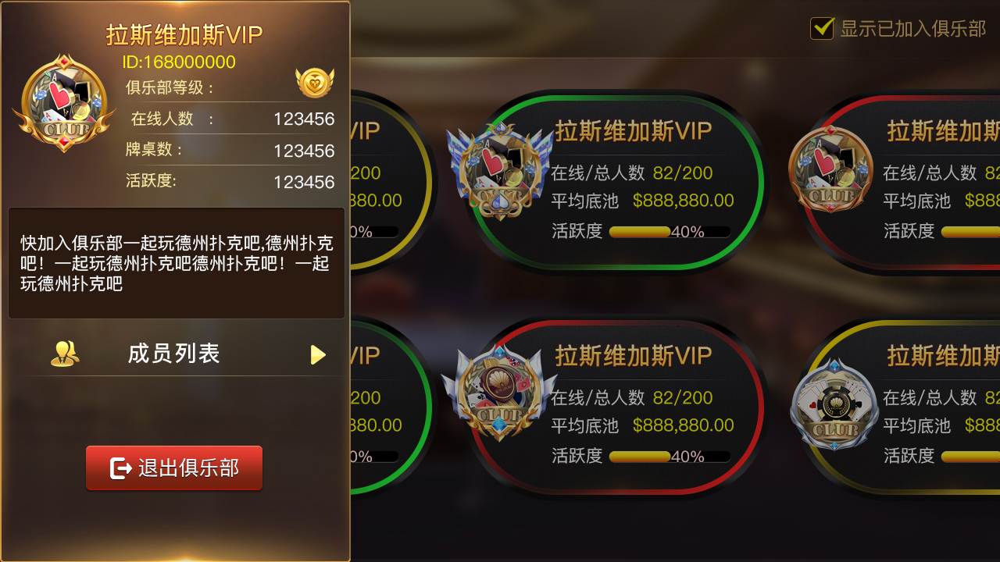
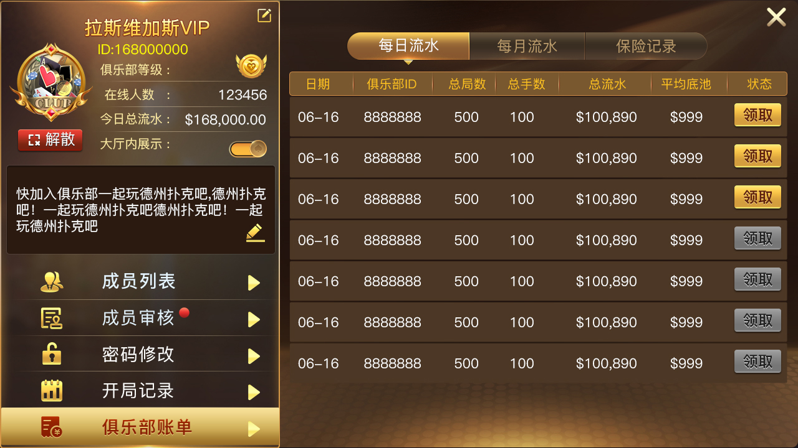
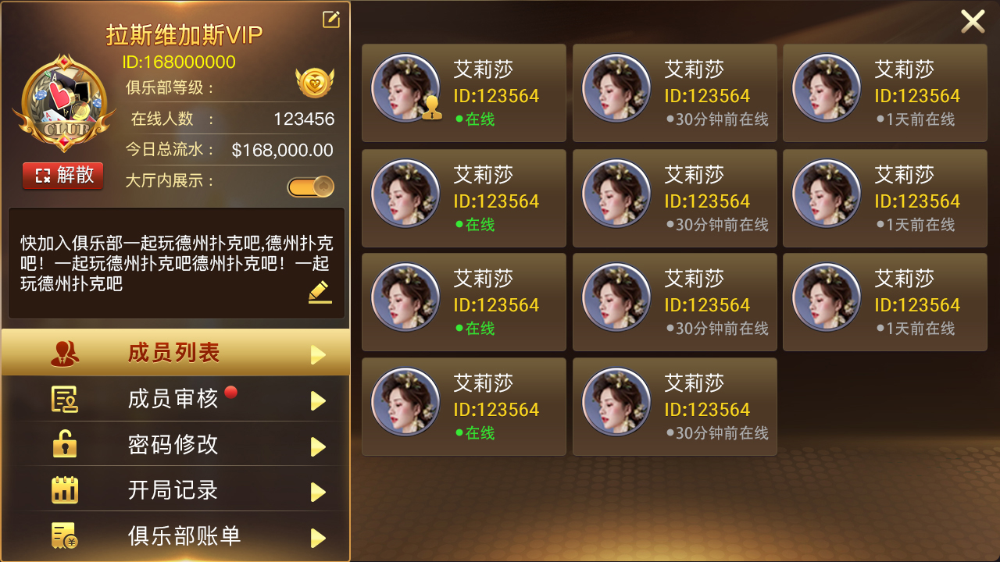

[简体中文](README.md) | [繁體中文](README.zh-TW.md) | **English**

# Mobile Texas Hold'em Source Code: Private Games and Poker Clubs

This repository presents a Texas Hold'em product for iOS, Android and mobile use cases. Product material describes private friend games, familiar-player tables, clubs, leagues, classic Hold'em, Omaha, Short Deck, OFC Pineapple, AOF, SNG and MTT. The public source snapshot mainly exposes C++/Tars push services, online and game-state processing, room reporting, club review and club-fund request models.

> The public repository is not a complete mobile client or commercial deployment package. Verify iOS, Android, H5, databases, admin panels, voice/video and full game implementations against the actual licensed delivery list. Concurrency, DAU, revenue and operating history require public load tests or audited evidence.

## Real product screenshots

| Mobile lobby | Multiplayer table | Club/friend-game entry |
|---|---|---|
|  |  |  |

| Private-game feature | Game settings | Results and account |
|---|---|---|
|  |  |  |

## Product capabilities

- **Private and familiar-player games:** documented social tables for known players, friend groups and internal events.
- **Clubs and leagues:** product material describes clubs, agents and leagues; public files expose club review, balance and fund-change request models.
- **Mobile product direction:** the repository contains Unity-style metadata, `link.xml` and resource directories, while complete iOS/Android/H5 projects require separate verification.
- **Real-time player state:** `UserStateProcessor` handles online state, game state, room address and statistics.
- **Push and broadcast:** `PushServantImp` exposes direct messages, broadcasts, online state, batch game state and room-user reporting.
- **Room and table reporting:** service interfaces include room users, blind users, online counts, table information and game addresses.
- **Configuration modules:** CRUD-style headers exist for props, rewards and ranking-board configuration.
- **Multiple game modes:** the documentation lists Hold'em, Omaha, Short Deck, OFC Pineapple, MTT, SNG and AOF, but the snapshot cannot verify every complete rules engine.

## Private friend-game flow

1. A player signs in on mobile and opens the lobby or club.
2. A host creates a private/friend table and selects visible room options.
3. Familiar players join through the club, invitation or room entry.
4. Server components track online state, game address and room information, then push updates.
5. The client displays results and history; club funds, review and permissions depend on the complete licensed platform.

## Verifiable source modules

| Area | Files | Verifiable responsibility |
|---|---|---|
| Push service | `PushServant.tars`, `PushServantImp.cpp/.h`, `PushServer.cpp` | Direct messages, broadcasts, state and room reporting |
| User state | `UserStateProto.tars`, `UserStateProcessor.cpp/.h` | Online/game state, room location and statistics |
| Club models | `audit_club.h`, `change_club_balance.h`, `change_club_fund.h` | Club review, balance and fund requests/responses |
| Game state | `gameconfig.cpp`, `gameparameter.cpp`, `gamebegin.h`, `onready.h` | Room initialization and state-processing samples |
| Configuration | `props_config/`, `props_reward_config/`, `rank_board_config/` | Props, rewards and ranking-board models |
| Build | `makefile` and Tars interface files | C++ build and service-interface entry points |

## Illustrated pages

- [Mobile Texas Hold'em source code](https://masterai-top.github.io/TexasHoldem-Poker-Mobile-Game-Source-Code/en/texas-holdem-mobile-source-code.html)
- [Private games and mobile poker clubs](https://masterai-top.github.io/TexasHoldem-Poker-Mobile-Game-Source-Code/en/private-club-poker-platform.html)
- [Simplified Chinese private-game page](https://masterai-top.github.io/TexasHoldem-Poker-Mobile-Game-Source-Code/zh-cn/private-poker-game.html)
- [Simplified Chinese familiar-player page](https://masterai-top.github.io/TexasHoldem-Poker-Mobile-Game-Source-Code/zh-cn/friend-poker-game.html)

## Clone and evaluate

```bash
git clone https://github.com/masterai-top/TexasHoldem-Poker-Mobile-Game-Source-Code.git
cd TexasHoldem-Poker-Mobile-Game-Source-Code
```

Before building, inspect compiler, include, library and target settings in `makefile`, then install compatible C++ and Tars dependencies. Cloning only provides the public snapshot, not necessarily a production mobile client, database or admin platform.

## Compliance and security

Private games, clubs, virtual items, payments or similar features may be regulated by gaming, payment, privacy and age laws. Before deployment, verify licensing, third-party assets, account permissions, message security, randomness, game logs, anti-cheat, payments and local law. Illegal use is prohibited.

Contact: Telegram `@xuzongbin001` · Email `ttpoker40@gmail.com` · [GitHub Issues](https://github.com/masterai-top/TexasHoldem-Poker-Mobile-Game-Source-Code/issues)

